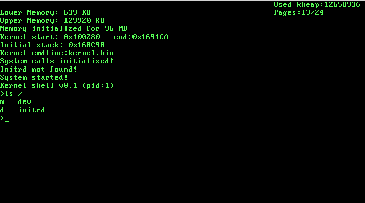

# soso
Soso is a simple unix-like operating system written in Nasm assembly and mostly in C. It supports multiboot, so it is started by Grub.
It can be built using Nasm and Clang. You can use GCC instead of Clang, if you want.
Tested build environments are Linux, FreeBSD, and Windows 10 (Windows Subsystem for Linux).

Soso is a 32-bit x86 operating system and its features are
- Multitasking with processes and threads
- Memory Paging with 4MB pages
- Kernelspace (runs in ring0) and userspace (runs in ring3) are separated
- Virtual File System
- FAT32 filesystem using FatFs
- System calls
- Libc (Newlib is ported with only basic calls like open, read,..)
- Can run userspace ELF files

Paging is written for 4MB page support, since it is easier to implement. Downside of this is, each process has to use at least 4MB memory.

Soso has Libc, so existing applications depending only on a small part of Libc can easly be ported to Soso. I have managed to build and run Lua on Soso!

# building
To build kernel just run:

    make

this will build only kernel (kernel.bin). 

To build userspace binaries (while in userspace directory):

    make

this will build userspace binaries in userspace/bin directory.

Now an initrd (initial ramdisk) image is needed to put userspace binaries. To create it, run as root (linux specific):

    ./create-initrd.sh

This will create initrd.fat file. This is a mountable FAT32 initrd image. Once kernel initialization is complete, initrd contents are copied into /dev/ramdisk1 and it is mounted to /initrd. After that kernel runs the /initrd/shell ELF file.

# running
QEMU has multiboot implementation so you can try the kernel with QEMU without creating a system image. Just run:

    qemu-system-i386 -kernel kernel.bin -initrd initrd.fat

# creating a system image
By creating an image, it is possible to run Soso on real hardware!
To create it, run as root (linux specific):

    ./create-image.sh
