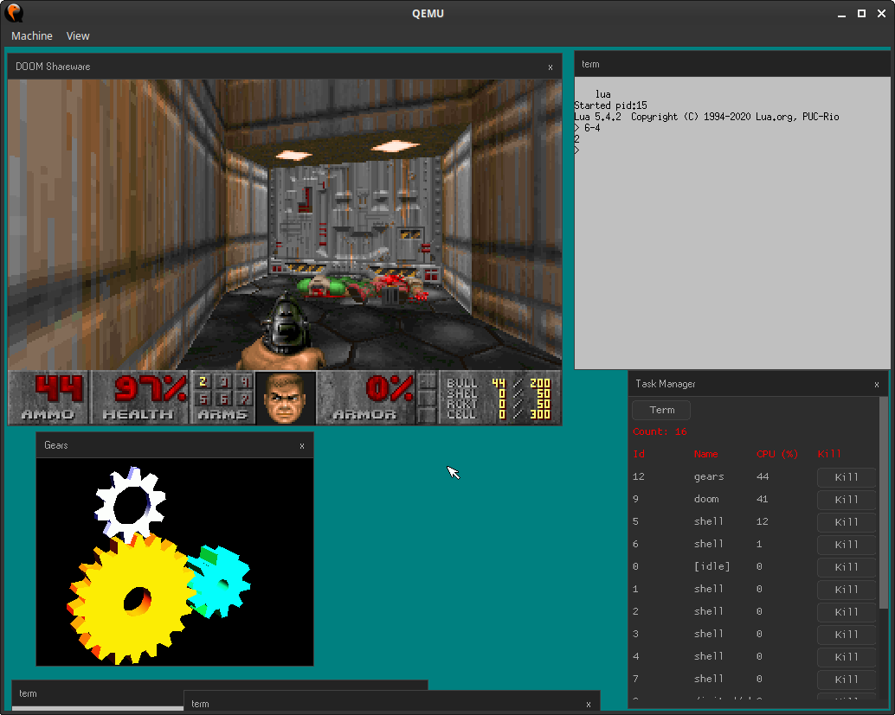

# soso
Soso is a simple unix-like operating system written in Nasm assembly and mostly in C. It supports multiboot, so it is started by Grub.
It can be built using Nasm and Clang.
Tested build environments are Linux, FreeBSD.

Soso is a 32-bit x86 operating system and its features are
- Multitasking with processes and threads
- Paging
- Kernelspace (runs in ring0) and userspace (runs in ring3) are separated
- Virtual File System
- FAT32 filesystem using FatFs
- System calls
- Libc (Musl is ported with basic calls like open, read,..)
- Userspace programs as ELF files
- mmap support
- Framebuffer graphics (userspace can access with mmap)
- Shared memory
- Serial port
- PS/2 mouse
- Unix sockets
- TTY driver

Soso has Libc, so existing applications depending only on Libc can easly be ported to Soso.
These applications run on Soso:
- Nano-X (client/server)
- Lua
- Doom

# running

You can download a [CD image (ISO file)](https://github.com/ozkl/soso/releases/download/v0.2/soso.iso.zip) from releases and try it in a PC emulator like QEMU. When it is started, you can run: "doom", "lua" in a terminal window.

To try Soso in QEMU, just run:

    qemu-system-i386 -cdrom soso.iso

# building
To build kernel just run:

    make

this will build only kernel (kernel.bin). 

Building userspace binaries will be documented later.

