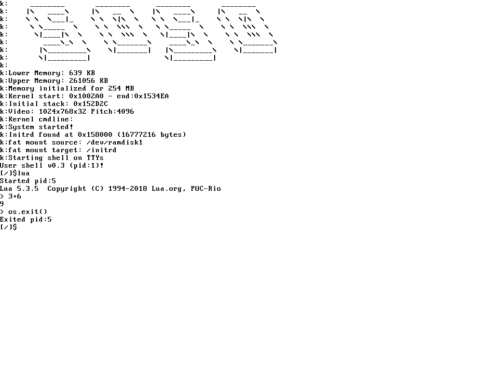
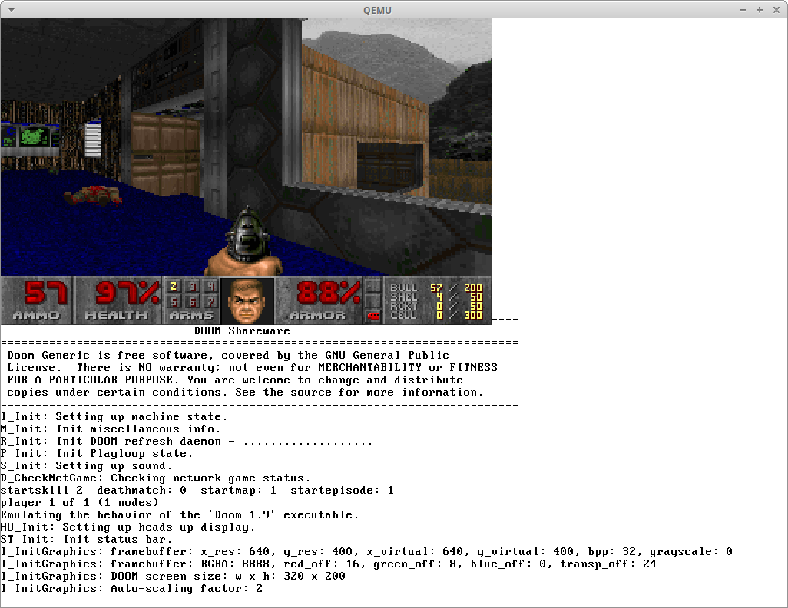

# soso
Soso is a simple unix-like operating system written in Nasm assembly and mostly in C. It supports multiboot, so it is started by Grub.
It can be built using Nasm and Clang.
Tested build environments are Linux, FreeBSD, and Windows 10 (Windows Subsystem for Linux). For installing Grub to disk image, Windows host is not supported.

Soso is a 32-bit x86 operating system and its features are
- Multitasking with processes and threads
- Memory Paging with 4MB pages
- Kernelspace (runs in ring0) and userspace (runs in ring3) are separated
- Virtual File System
- FAT32 filesystem using FatFs
- System calls
- Libc (Musl is ported with basic calls like open, read,..)
- Userspace programs as ELF files
- mmap support
- Framebuffer graphics (userspace can access with mmap)
- Shared memory

Paging is written for 4MB page support, since it is easier to implement. In this way, a Page Directory Entry points directly to a 4MB Page Frame. In 4KB mechanism, a Page Directory Entry points to a Page Table Entry which then points to a 4KB Page Frame.
Downside of using 4MB pages is, each process has to use at least 4MB memory.

Soso has Libc, so existing applications depending only on a small part of Libc can easly be ported to Soso. I have managed to build and run Lua and Doom on Soso!

# running

You can download a [CD image (ISO file)](https://github.com/ozkl/soso/releases/download/v0.2/soso.iso.zip) from releases and try in a virtualization software like VirtualBox or in a PC emulator like QEMU. When it is started, you can run: "doom", "ls", "lua". Executables are in /initrd.

To try Soso in QEMU, just run:

    qemu-system-i386 -cdrom soso.iso

## Lua

## Doom
To demonstrate multitasking, two doom processes running at the same time:

# building
To build kernel just run:

    make

this will build only kernel (kernel.bin). 

To build userspace binaries (while in userspace directory):

    make

this will build userspace binaries in userspace/bin directory.

Now an initrd (initial ramdisk) image is needed to put userspace binaries. To create it, run as root (linux specific):

    ./create-initrd.sh

This will create initrd.fat file. This is a mountable FAT32 initrd image. Once kernel initialization is complete, initrd contents are copied into /dev/ramdisk1 and it is mounted to /initrd. After that kernel runs the /initrd/shell ELF file.

    ./create-cd-image.sh
    
This will create soso.iso cd image.

